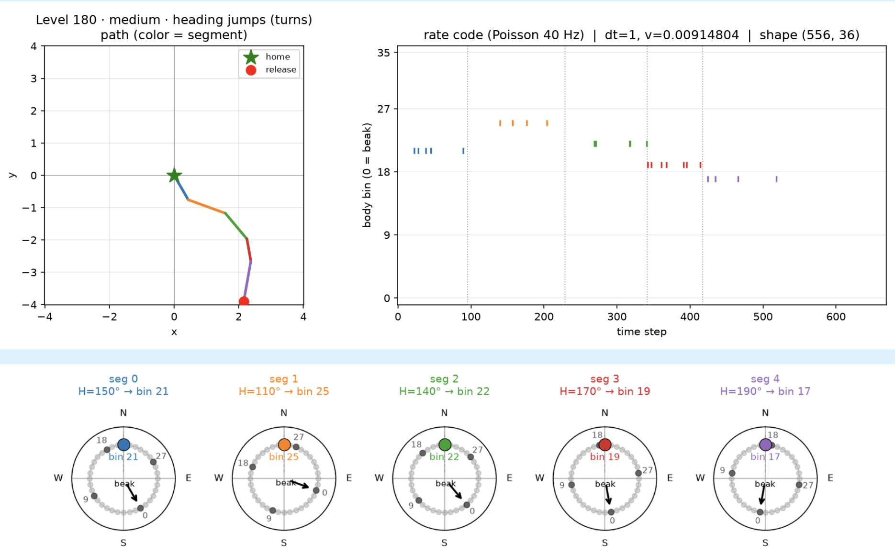
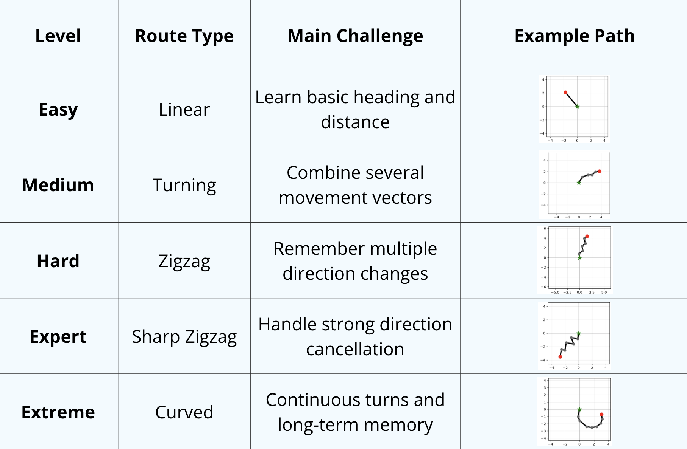
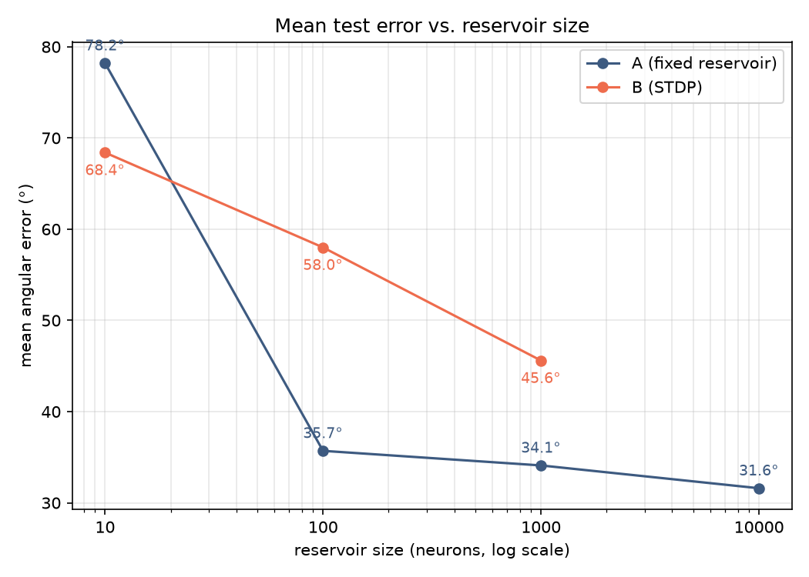
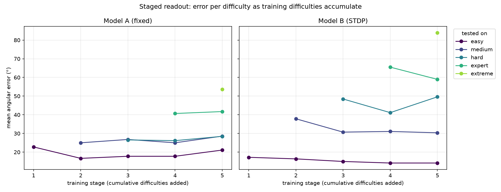
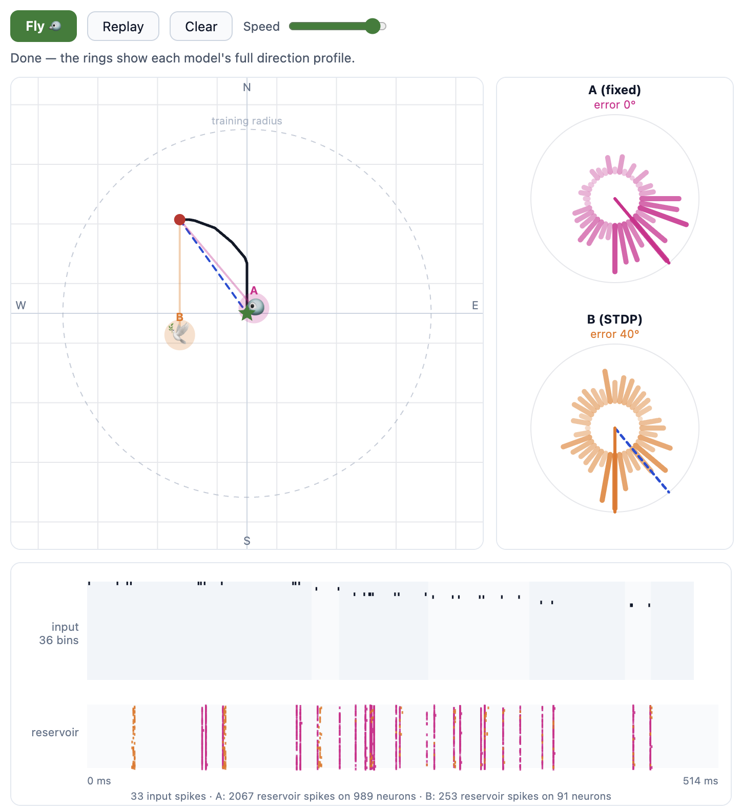

# PigeonPilot
A research project exploring Reservoir Computing in Spiking Neural Networks built in the scope of a "Hackathon for Spiking Neural Networks" seminar at "Universität Osnabrück".


## Project description

### Inspiration
Pigeons can keep track of their own movement and find their way back home. One of the ways they orient themselves is by sensing earth's magnetic field and thus knowing where north is.

This is a path integration problem: A pigeon is taken from point A to point B on a path with only the directional information of where north is on every step of the way and wants to find the direction back to point A.) The point of this project is not to solve this problem in an efficient way (it is solvable with a simple deterministic algorithm), but to find out how a spiking reservoir will perform on a path integration task.

Specifically we will implement a Spiking Reservoir with linear readout and add STDP in a second step to compare the 2 methods.

### Research questions

> Can a recurrent LIF reservoir solve a path-finding problem with a ridge regression readout function?

> Does the implementation of plasticity with STDP improve the result?

### Encoding
We use poisson rate encoding with a firing rate of 40hz. The input layer consists of 36 input neurons, each encoding for 10 degrees in the 360 degrees circle. While the pigeon is being transported from point A to point B, the input neuron spikes, that is currently positioned in the north direction. For this, the head of the pigeon is positioned, such that its beak points forward on the path it takes.


### Dataset
We construct a dataset of almost 600 paths, divided into 5 levels of difficulty, such that it is easier to point out on which paths the model performs better or worse.


### Model Architecture
We build 2 networks. `network_a` has an input layer of 36 neurons with feed-forward connections into an untrained recurrently connected reservoir that has 20% inhibitory connection and randomly initialized weights. `network_b` uses the same structure but adds an STDP training step to introduce plasticity to the network. Then we apply a linear ridge regression to both networks to convert the reservoir firing into an output (the direction in degrees back to home).

### Experiments
We started tuning the following 3 parameters ith the goal of bringing mean reservoir neuron activity down to 20-30% and reducing the total testing error as far as possible.
```
FEEDFORWARD_STRENGTH = 50
RIDGE_ALPHA = 0.01
STDP_NU = (1e-3, 1e-3)
```

Other parameters either didn't have a big influence on the outcome or we used common standard values to stay in the scope of this project timewise.
```
# --- weight initialization ---
FEEDFORWARD_STRENGTH = 50 # normalization constant - the total strength that will go into the reservoir
RESERVOIR_SCALE = 0.9  # scaling constant for the recurrent connections in the reservoir
WMIN, WMAX = 0.0, 10.0  # feedforward connection clamp (weights are always >= 0)

# --- inhibitory weights ---
INHIB_FRACTION = 0.2       # 20 percent of connections in the reservoir are inhibitory
INHIB_WEIGHT_RATIO = 1.0   # inhibitory synapses are this many times stronger than excitatory
RESERVOIR_WMIN, RESERVOIR_WMAX = -WMAX, WMAX # connection clamp for the reservoir (inhibitory weights are negative)

# --- learning parameters ---
LIF_KW = dict(rest=-65.0, reset=-65.0, thresh=-52.0, refrac=5, tc_decay=250.0)
STDP_NU =(1e-3, 1e-3)  # learning rate for STDP
STDP_TC_PRE = 20.0 # pre-synaptic trace time constant of 20 ms for STDP
STDP_TC_POST = 20.0 # post-synaptic trace time constant of 20 ms for STDP

# --- readout function: Ridge Regression ---
RIDGE_ALPHA = 0.01
```
Then we trained and tested the models for different neuron sizes: 10, 100, 1000, 10000.

### Results

The mean error of `network_a` can be pushed down to 31.6 degrees for 10000 neurons, performing better for easier levels and worse for more difficult levels.
The other `network_b` performs consistently worse with a mean error of 45.6 degrees for 1000 neurons. This seems counter intuitive at first, given that plasticity is applied on top of a reservoir that already works well. But since the randomness of the reservoir is exactly what makes it work, the added plasticity could reduce the resulting entropy making it harder for the readout function to detect patterns. If you would increase training phases of the STDP (currently we only present each data point 3 times for time reasons) it will probably work better and could possibly outperform `network_a`.


We trained and tested the models in stages of difficulty to see how training on higher difficulties will influence the performence of already trained lower levels. We can see, in this example with 1000 neurons that easier paths keep their low error throughout the process.

## Code Guide

### Models

- run `/models/Models.ipynb` to create a reservoir model (`network_a`) and a plasticity model (`network_b`) and train and test it on all data.
- run `/models/Models_staged.ipynb` to create a reservoir model (`network_a`) and a plasticity model (`network_b`) and train and test it on the 5 levels of difficulty one by one in stages.
- run `/models/Reservoir_only_staged.ipynb` to create only a reservoir model (`network_a`) train and test it on all data and train and test it on the 5 levels of difficulty one by one in stages. This makes sense when STDP training takes too long for large networks.

You can play around with the parameters here, make visualizations of performances and export the models.

### Outputs
In `/outputs` there are 5 pre-generated models of different neuron sizes we used in our results. Newly generated models will appear here.

### Playground
Run `Playground.ipynb` to test your models on a graphical interface. You can draw a path and watch the pigeon find its way back.
Change the `RUN_NAME` parameter to import different models from `/outputs/checkpoints`.


### Results
- `/results/results.md` holds a summary of our results with relevant plots and outputs
- `/parameter_tuning_scripts/` holds 2 scripts we used to test for different parameters.
- `/results/parameter_tuning.txt` holds a summary of our parameter tuning process with outputs from the scripts.
- `DatasetVisualizations.ipynb` is a collection of visualizations of the dataset and concept

Happy flying!!


