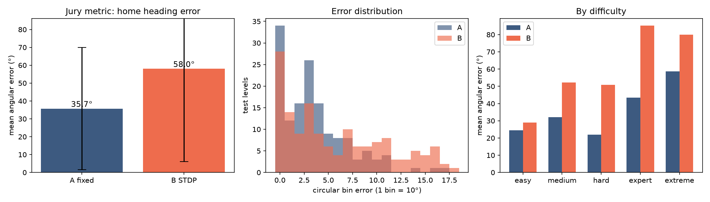
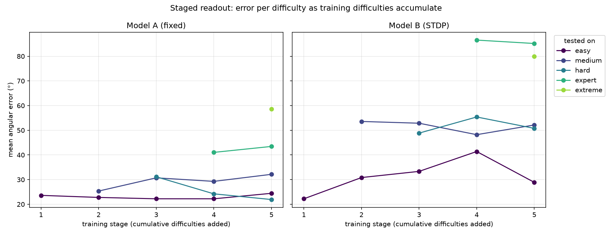
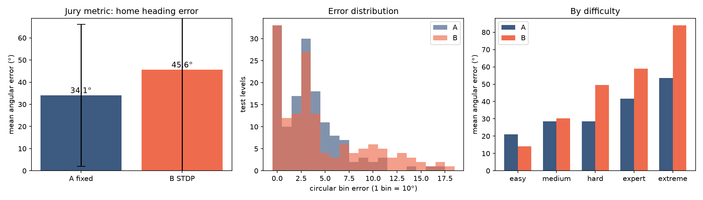
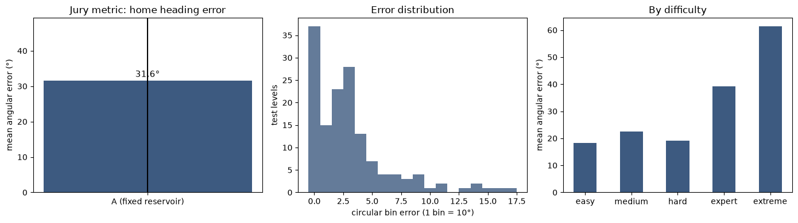
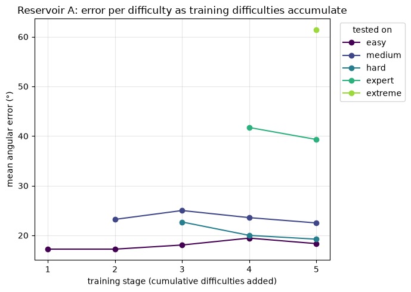

# RESERVOIR AND STDP comparison

## ALL NEURON SIZES COMPARISON

## NEURON SIZE 10

=== Test angular error (circular) ===
Pigeon A (fixed):  mean error 78.2° ± 51.9°  | exact-bin acc 6.8%
Pigeon B (STDP):   mean error 68.4° ± 56.4°  | exact-bin acc 12.9%

By difficulty (mean °):
  easy      A= 74.4°   B= 53.3°   n=36
  medium    A= 74.6°   B= 76.4°   n=28
  hard      A= 78.5°   B= 65.0°   n=26
  expert    A= 77.6°   B= 63.1°   n=29
  extreme   A= 86.8°   B= 88.2°   n=28

stage | trained on                               | tested on |    n |    A ° |  A acc |    B ° |  B acc
-------------------------------------------------------------------------------------------------------
    1 | easy                                     | easy     |   36 |   56.1 |  44.4% |   48.9 |  50.0%
    2 | easy + medium                            | easy     |   36 |   74.4 |  11.1% |   66.1 |  33.3%
    2 | easy + medium                            | medium   |   28 |   68.6 |   7.1% |   74.6 |   7.1%
    3 | easy + medium + hard                     | easy     |   36 |   67.2 |  16.7% |   65.3 |  27.8%
    3 | easy + medium + hard                     | medium   |   28 |   72.9 |   0.0% |   71.4 |   7.1%
    3 | easy + medium + hard                     | hard     |   26 |   80.0 |   7.7% |   64.2 |   3.8%
    4 | easy + medium + hard + expert            | easy     |   36 |   64.4 |  13.9% |   61.4 |  33.3%
    4 | easy + medium + hard + expert            | medium   |   28 |   77.5 |   3.6% |   67.5 |   7.1%
    4 | easy + medium + hard + expert            | hard     |   26 |   66.9 |   3.8% |   50.8 |   3.8%
    4 | easy + medium + hard + expert            | expert   |   29 |   75.2 |   3.4% |   68.6 |   3.4%
    5 | easy + medium + hard + expert + extreme  | easy     |   36 |   74.4 |  11.1% |   53.3 |  33.3%
    5 | easy + medium + hard + expert + extreme  | medium   |   28 |   74.6 |   7.1% |   76.4 |  10.7%
    5 | easy + medium + hard + expert + extreme  | hard     |   26 |   78.5 |   0.0% |   65.0 |   3.8%
    5 | easy + medium + hard + expert + extreme  | expert   |   29 |   77.6 |   6.9% |   63.1 |   3.4%
    5 | easy + medium + hard + expert + extreme  | extreme  |   28 |   86.8 |   7.1% |   88.2 |   7.1%

## NEURON SIZE 100

=== Test angular error (circular) ===
Pigeon A (fixed):  mean error 35.7° ± 34.2°  | exact-bin acc 23.1%
Pigeon B (STDP):   mean error 58.0° ± 52.0°  | exact-bin acc 19.0%

By difficulty (mean °):
  easy      A= 24.4°   B= 28.9°   n=36
  medium    A= 32.1°   B= 52.1°   n=28
  hard      A= 21.9°   B= 50.8°   n=26
  expert    A= 43.4°   B= 85.2°   n=29
  extreme   A= 58.6°   B= 80.0°   n=28

stage | trained on                               | tested on |    n |    A ° |  A acc |    B ° |  B acc
-------------------------------------------------------------------------------------------------------
    1 | easy                                     | easy     |   36 |   23.6 |  75.0% |   22.2 |  77.8%
    2 | easy + medium                            | easy     |   36 |   22.8 |  69.4% |   30.8 |  58.3%
    2 | easy + medium                            | medium   |   28 |   25.4 |  14.3% |   53.6 |   7.1%
    3 | easy + medium + hard                     | easy     |   36 |   22.2 |  69.4% |   33.3 |  55.6%
    3 | easy + medium + hard                     | medium   |   28 |   30.7 |  10.7% |   52.9 |   7.1%
    3 | easy + medium + hard                     | hard     |   26 |   31.2 |  11.5% |   48.8 |  11.5%
    4 | easy + medium + hard + expert            | easy     |   36 |   22.2 |  72.2% |   41.4 |  47.2%
    4 | easy + medium + hard + expert            | medium   |   28 |   29.3 |  14.3% |   48.2 |   7.1%
    4 | easy + medium + hard + expert            | hard     |   26 |   24.2 |  15.4% |   55.4 |   7.7%
    4 | easy + medium + hard + expert            | expert   |   29 |   41.0 |   3.4% |   86.6 |   0.0%
    5 | easy + medium + hard + expert + extreme  | easy     |   36 |   24.4 |  66.7% |   28.9 |  61.1%
    5 | easy + medium + hard + expert + extreme  | medium   |   28 |   32.1 |   7.1% |   52.1 |   7.1%
    5 | easy + medium + hard + expert + extreme  | hard     |   26 |   21.9 |  19.2% |   50.8 |   3.8%
    5 | easy + medium + hard + expert + extreme  | expert   |   29 |   43.4 |   3.4% |   85.2 |   3.4%
    5 | easy + medium + hard + expert + extreme  | extreme  |   28 |   58.6 |   7.1% |   80.0 |   7.1%

## NEURON SIZE 1000

=== Test angular error (circular) ===
Pigeon A (fixed):  mean error 34.1° ± 32.0°  | exact-bin acc 22.4%
Pigeon B (STDP):   mean error 45.6° ± 46.1°  | exact-bin acc 22.4%

By difficulty (mean °):
  easy      A= 21.1°   B= 14.2°   n=36
  medium    A= 28.6°   B= 30.4°   n=28
  hard      A= 28.5°   B= 49.6°   n=26
  expert    A= 41.7°   B= 59.0°   n=29
  extreme   A= 53.6°   B= 83.9°   n=28

stage | trained on                               | tested on |    n |    A ° |  A acc |    B ° |  B acc
-------------------------------------------------------------------------------------------------------
    1 | easy                                     | easy     |   36 |   22.8 |  77.8% |   17.2 |  77.8%
    2 | easy + medium                            | easy     |   36 |   16.7 |  80.6% |   16.4 |  77.8%
    2 | easy + medium                            | medium   |   28 |   25.0 |  10.7% |   37.9 |  14.3%
    3 | easy + medium + hard                     | easy     |   36 |   17.8 |  77.8% |   15.0 |  77.8%
    3 | easy + medium + hard                     | medium   |   28 |   26.8 |   7.1% |   30.7 |  14.3%
    3 | easy + medium + hard                     | hard     |   26 |   26.5 |   0.0% |   48.5 |   0.0%
    4 | easy + medium + hard + expert            | easy     |   36 |   17.8 |  77.8% |   14.2 |  77.8%
    4 | easy + medium + hard + expert            | medium   |   28 |   25.0 |  10.7% |   31.1 |  14.3%
    4 | easy + medium + hard + expert            | hard     |   26 |   26.2 |   3.8% |   41.2 |   3.8%
    4 | easy + medium + hard + expert            | expert   |   29 |   40.7 |   3.4% |   65.5 |   3.4%
    5 | easy + medium + hard + expert + extreme  | easy     |   36 |   21.1 |  75.0% |   14.2 |  77.8%
    5 | easy + medium + hard + expert + extreme  | medium   |   28 |   28.6 |   7.1% |   30.4 |  10.7%
    5 | easy + medium + hard + expert + extreme  | hard     |   26 |   28.5 |   7.7% |   49.6 |   0.0%
    5 | easy + medium + hard + expert + extreme  | expert   |   29 |   41.7 |   3.4% |   59.0 |   3.4%
    5 | easy + medium + hard + expert + extreme  | extreme  |   28 |   53.6 |   3.6% |   83.9 |   3.6%

# ONLY RESERVOIR

## NEURON SIZE 10000

=== Test angular error (circular) ===
Pigeon A (fixed):  mean error 31.6° ± 35.0°  | exact-bin acc 25.2%

By difficulty (mean °):
  easy      A= 18.3°   n=36
  medium    A= 22.5°   n=28
  hard      A= 19.2°   n=26
  expert    A= 39.3°   n=29
  extreme   A= 61.4°   n=28

stage | trained on                               | tested on |    n |    A ° |  A acc
-------------------------------------------------------------------------------------
    1 | easy                                     | easy     |   36 |   17.2 |  80.6%
    2 | easy + medium                            | easy     |   36 |   17.2 |  80.6%
    2 | easy + medium                            | medium   |   28 |   23.2 |  17.9%
    3 | easy + medium + hard                     | easy     |   36 |   18.1 |  75.0%
    3 | easy + medium + hard                     | medium   |   28 |   25.0 |  14.3%
    3 | easy + medium + hard                     | hard     |   26 |   22.7 |  11.5%
    4 | easy + medium + hard + expert            | easy     |   36 |   19.4 |  69.4%
    4 | easy + medium + hard + expert            | medium   |   28 |   23.6 |  21.4%
    4 | easy + medium + hard + expert            | hard     |   26 |   20.0 |  11.5%
    4 | easy + medium + hard + expert            | expert   |   29 |   41.7 |   3.4%
    5 | easy + medium + hard + expert + extreme  | easy     |   36 |   18.3 |  72.2%
    5 | easy + medium + hard + expert + extreme  | medium   |   28 |   22.5 |  21.4%
    5 | easy + medium + hard + expert + extreme  | hard     |   26 |   19.2 |  11.5%
    5 | easy + medium + hard + expert + extreme  | expert   |   29 |   39.3 |   3.4%
    5 | easy + medium + hard + expert + extreme  | extreme  |   28 |   61.4 |   3.6%

