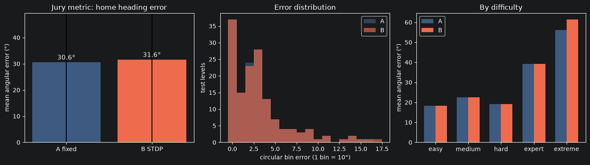

ONLY RESERVOIR

10.000 neurons:

=== Test angular error (circular) ===
Pigeon A (fixed):  mean error 30.6° ± 33.1°  | exact-bin acc 25.2%

By difficulty (mean °):
  easy      A= 18.3°   B= 18.3°   n=36
  medium    A= 22.5°   B= 22.5°   n=28
  hard      A= 19.2°   B= 19.2°   n=26
  expert    A= 39.3°   B= 39.3°   n=29
  extreme   A= 56.1°   B= 61.4°   n=28

